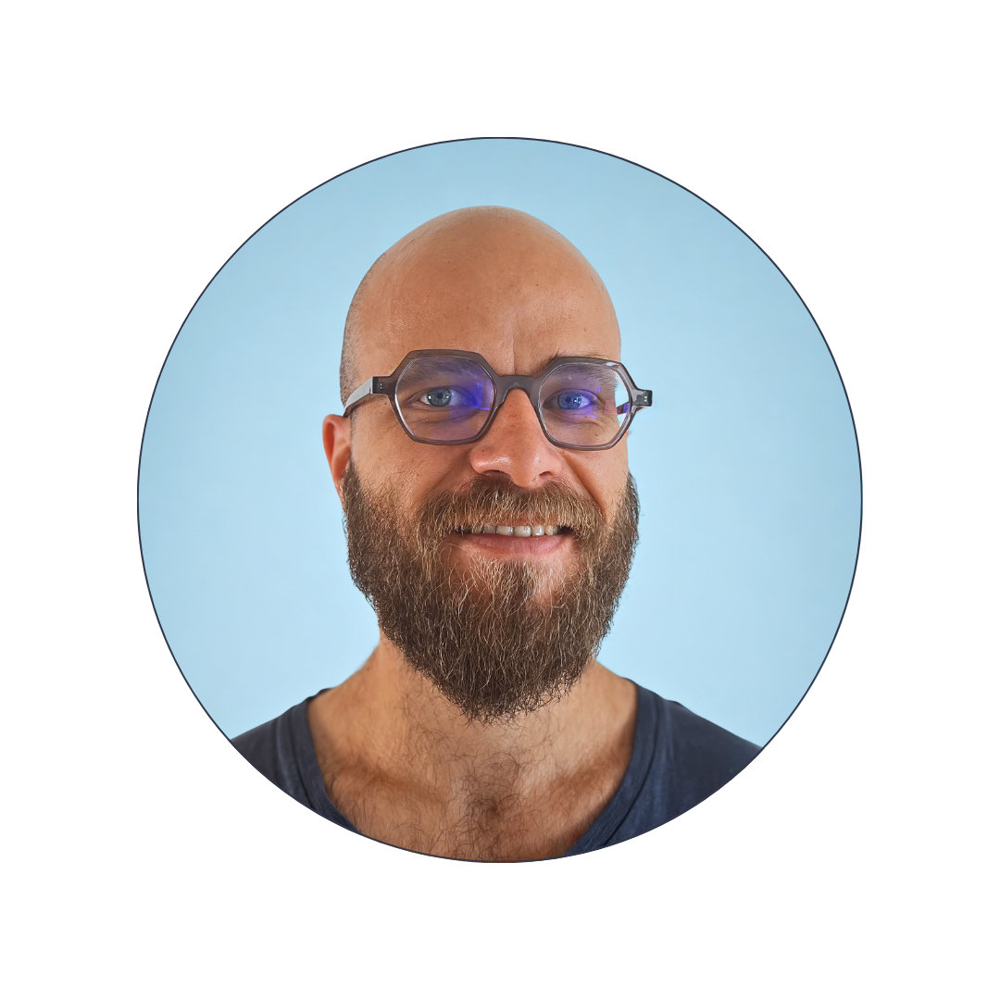

# Pierre Courteille

**DevOps - Cloud Engineer (AWS - 4x Certified)**

📞 (+33) 6 08 04 22 44 | 📧 pierre.courteille@gmail.com

## Profile
- AWS-focused DevOps / Cloud Engineer designing secure, scalable, and highly available infrastructures
- Strong emphasis on multi-account / multi-region patterns, isolation, and operational observability
- Infrastructure as Code (AWS CDK / Terraform) and CI/CD automation with proven delivery patterns

## Certifications
- AWS Certified DevOps Engineer - Professional (DOP-C02) — 2025
- AWS Certified Solutions Architect - Associate (SAA-C03) — 2025
- AWS Certified Developer - Associate (DVA-C02) — 2025
- AWS Certified Cloud Practitioner (CLF-C02) — 2025

## Education
- **Master MOCA (Modeling, Optimization, Combinatorics, Algorithms)** - Universite de Montpellier - 2015
- **Bachelor's Degree in Mathematics & Computer Science** - Universite de Nantes - 2013
- **Scientific Baccalaureat with High Honors** - Fougeres - 2009

## Experience

### DevOps / Cloud Engineer (Freelance) - IEC
Geneva (Switzerland) | September 2025 - Present

- Designed and implemented a SaaS platform using a full silo isolation model (1 tenant = 1 dedicated AWS account) aligned with AWS SaaS best practices for strict isolation, security, and compliance.

**Highlights**
- **SaaS isolation by design:** 1 tenant per AWS account + dedicated VPC per tenant, account-level IAM, least-privilege policies, and blast-radius reduction
- **Infrastructure as Code:** reusable AWS CDK template to deploy standardized tenant stacks (Docker, ECS Fargate) with environment parity across hundreds of tenants
- **Observability at scale:** centralized monitoring account in AWS Organizations; CloudWatch OAM for cross-account ingestion; Amazon Managed Grafana (CloudWatch + Prometheus-compatible metrics); CloudWatch Synthetics canaries; CloudWatch Alarms + SNS notifications (all provisioned via CDK)

**Results**
- Secure, compliant foundation for regulated / security-sensitive customers
- Predictable isolation with minimal blast radius
- Centralized, scalable observability across isolated accounts

**Tech Stack**
- AWS (ECS Fargate, VPC, IAM, ALB, CloudWatch, OAM, Synthetics, SNS, S3, KMS, Organizations), Amazon Managed Grafana, Prometheus; AWS CDK, Terraform, Docker, GitLab CI; Python

---

### DevOps / Cloud Engineer (Freelance) - Premaccess
Paris (France) | June 2019 - September 2025

Premaccess is a Franco-Swiss AWS transformation and managed-services provider. Supported multiple customers across AWS migration, evolution, and continuous optimization.

**Highlights**
- **AWS migrations + continuous evolution:** delivered migrations and adopted tailored AWS services across growth stages (containers, serverless, data, edge)
- **Network + security:** multi-AZ VPCs (public/private/isolated), Security Groups + NACL hardening, VPC endpoints + flow logs, IAM Identity Center/IAM/SCPs, KMS encryption
- **Compute platforms:** ECS (Fargate) + EKS for HA microservices; Lambda + API Gateway for event-driven workloads; EC2 + ASG + ALB/NLB when needed
- **Data + messaging:** RDS (Aurora, Serverless v2), DynamoDB, ElastiCache, Redshift; SQS/SNS/EventBridge
- **Edge + delivery automation:** CloudFront + WAF; Route 53 + ACM; IaC (AWS CDK/CloudFormation, Terraform when requested); CI/CD (CodePipeline/CodeBuild/CodeDeploy, GitLab CI, Jenkins)

**Tech Stack**
- AWS (EC2, ASG, ALB/NLB, ECS, EKS, Lambda, RDS, DynamoDB, ElastiCache, SQS, SNS, EventBridge, CloudFront, S3, KMS, WAF, Route 53), Python/Node.js/.NET Core; AWS CDK/CloudFormation; GitLab, Jenkins, CodeCommit; Docker, Kubernetes

---

### .NET Technical Instructor - ISIKA
Paris (France) | March 2020 - June 2023

- Delivered a C# training module focused on clean code, architecture, and maintainable .NET development.
- Covered OOP fundamentals and data persistence (MySQL, LINQ, Entity Framework), plus ASP.NET client app development (MVC, WinForms/WebForms).

**Tech Stack**
- C#, Visual Studio, Entity Framework 6, LINQ, MySQL, HTML/CSS, MVC, ASP.NET

---

### Quality Manager - Bassetti
Kolkata (India) | 2016 - 2018

- Built and led a QA department from scratch for the TEEXMA platform in a fast-growing international environment.
- Recruited, trained, and managed up to 25 QA engineers; developed a high-performance automated testing platform (~10,000 tests/hour) and integrated scheduled automated testing into CI/CD.

**Tech Stack**
- C#, Selenium, .NET, SVN, Sheets API, Jenkins, XML, Excel

