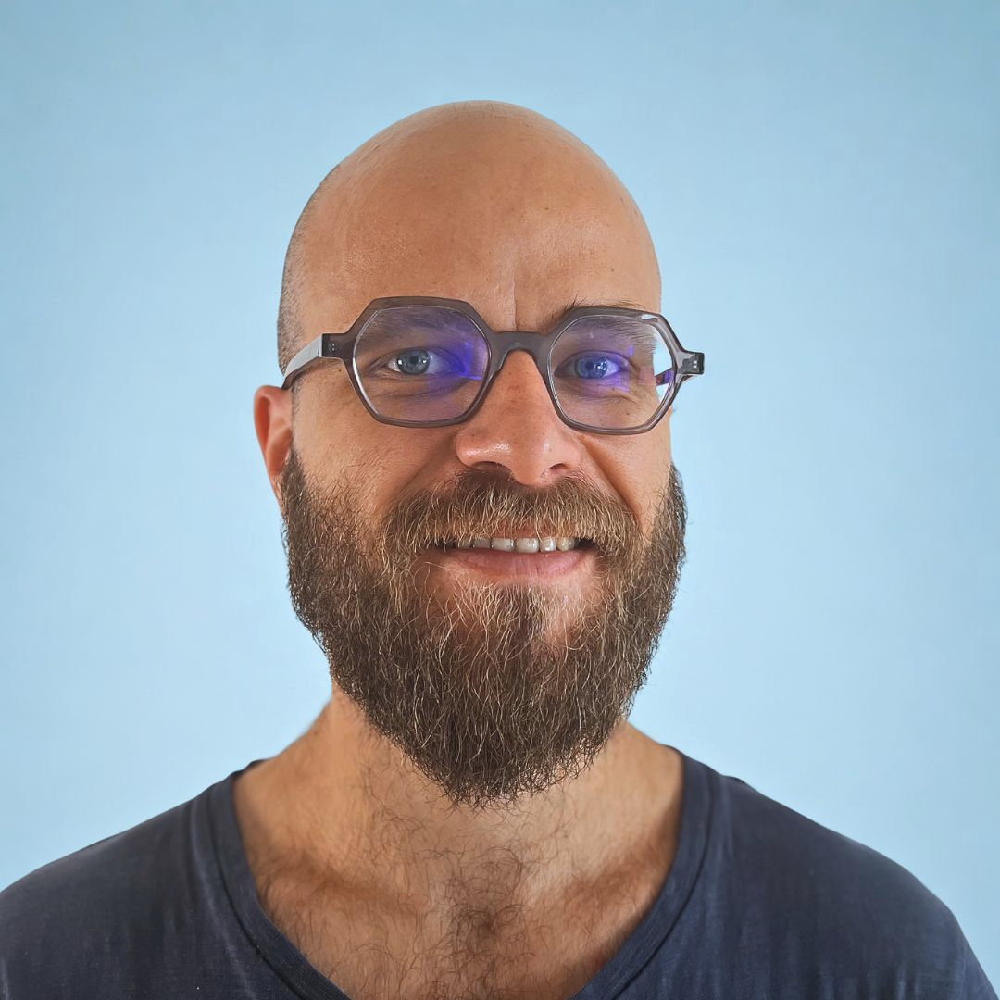

# Pierre Courteille

**Cloud Architect (Freelance)** | AWS · DevOps · CDK · Terraform · SaaS · Multi-Account (AWS Organizations) | **4x AWS Certified**

📞 (+33) 6 08 04 22 44 | 📧 pierre.courteille@gmail.com | [LinkedIn](https://www.linkedin.com/in/pierre-courteille-b7432b186/) | Geneva, Switzerland

<h2 align="center">Profile</h2>

- Cloud & DevOps engineer — **AWS expert (4x certified)**: **architecture, security, and automation**. I help organizations **design, migrate, and optimize** AWS infrastructure with a strong focus on **security, scalability, and performance**.
- **CI/CD** implementation, **IaC** (CDK, CloudFormation), and **resilient** platform architecture. Core AWS: **EKS, EC2, ECS, Lambda, RDS, VPC, CloudFormation, CDK, SAM, IAM**, and related services.
- **8+ years** of experience | **20+ clients** | **4 AWS certifications**. Priorities: security, performance, scalability, robustness. Motivated by **complex** work at the intersection of **cloud** and **math / optimization**.

<h2 align="center">Certifications (AWS)</h2>

- AWS Certified Developer – Associate (DVA-C02) — issued Jul 2025, expires Jul 2028
- AWS Certified DevOps Engineer – Professional (DOP-C02) — issued Jul 2025, expires Jul 2028
- AWS Certified Solutions Architect – Associate (SAA-C03) — issued Jul 2025, expires Jul 2028
- AWS Certified Cloud Practitioner (CLF-C02) — issued Jun 2025, expires Jul 2028

<h2 align="center">Education</h2>

- **Master’s, Mathematics & Computer Science** (Master **MOCA** — modeling, optimization, combinatorics, algorithms) — Université de Montpellier — 2012–2015
- **Bachelor’s, Mathematics & Computer Science** — Université de Nantes — 2009–2012

<h2 align="center">Experience</h2>

### Cloud Engineer — Qim info · International Electrotechnical Commission (IEC)
Oct 2025 – Present · Geneva, Switzerland · Hybrid

Design and operation of **multi-account AWS** environments for several applications, with emphasis on **security, scalability, and automation**.

- **SaaS architecture (Silo model):** multi-tenant design (**1 tenant = 1 AWS account**) via **AWS Organizations**; strong isolation (network, IAM, data) and reduced blast radius
- **Multi-account governance & security:** account structure (OUs, **SCPs**), centralized governance, least privilege, secure cross-account access
- **IaC & delivery:** **AWS CDK** platform to deploy **Docker** microservices on **ECS Fargate**; automated tenant onboarding and standardized deployments
- **Observability (multi-account / multi-region):** centralized stack with **CloudWatch OAM** and dedicated monitoring account; **Grafana**, centralized logs/metrics, alerting (**CloudWatch, SNS**), synthetic monitoring
- **Operations & optimization:** VPC management, **WAF** on **CloudFront**, **EC2 → ECS** migrations, log analysis (**Athena**, **Logs Insights**)

**Stack:** AWS, AWS Organizations, CDK, Terraform, ECS Fargate, Docker, CloudWatch, Grafana, WAF, Athena, Python

---

### Cloud Engineer (freelance) — Premaccess
Jun 2019 – Sep 2025 · Paris, Île-de-France, France · Hybrid

Support for multiple clients on **AWS cloud transformation**: migration through optimization and scale-out, with strong **automation, security, and performance** focus.

- **Cloud migration & scalability:** led migrations and continuous architecture improvements — **ECS, EKS**, serverless (**Lambda, API Gateway**), managed data (**RDS, DynamoDB, Redshift, ElastiCache**)
- **Network & security:** multi-AZ **VPC** (public / private / isolated subnets); **Security Groups, NACLs, VPC Endpoints**; **IAM Identity Center, SCPs**; **KMS** encryption
- **CI/CD & IaC:** **CodePipeline, CodeBuild, GitLab CI, Jenkins**; **CDK, CloudFormation, Terraform**
- **Observability & FinOps:** **CloudWatch, X-Ray, Config, Security Hub**; FinOps dashboards (**Budgets, CUR, Cost Explorer**)
- **Automation & performance:** internal **provisioning tool** (Python, Boto3); **C#** refactor (**+40% throughput, –30% latency**); **serverless** with **AWS SAM**; **L2/L3** support and architecture reviews

**Stack:** AWS, Python, Node.js, .NET Core, Docker, Kubernetes, CDK, Terraform

---

### .NET Instructor & Software Engineer (freelance) — ISIKA
Mar 2020 – Apr 2023 · Paris, Île-de-France, France · Hybrid

**C# and .NET** training with a focus on **OOP** and application design.

- **Technical training:** C# fundamentals, **OOP** (classes, inheritance), **desktop** development (**WinForms**)
- **Application development:** guided learners through full apps including **data persistence** (**LINQ, Entity Framework, MySQL**)
- **Pedagogy:** project follow-up and skills development through to assessed deliverables

**Stack:** C#, HTML5, Entity Framework, LINQ, MySQL, WinForms

---

### Software Quality Assurance Manager — Bassetti
Feb 2016 – May 2018 · Kolkata area, India · Full-time

Built and led a **QA organization** in India: team leadership, **large-scale test automation**, and **DevOps** practices.

- **Hiring & leadership:** recruited, trained, and led **25+ QA engineers**, scaling test capacity for product growth
- **Automation & tooling:** co-designed an internal platform executing **10,000+ API tests/hour**, improving coverage and efficiency
- **Quality & delivery:** close collaboration with development; automated feedback loops and **daily** tests, shorter regression cycles
- **Process & DevOps:** introduced **DevOps** practices, stronger QA–dev collaboration, faster release cadence

**Stack:** C#, .NET, Selenium, Jenkins, APIs, XML, Excel

---

### Optimization Engineer — Kronos Incorporated (Ad Opt)
Jan 2015 – Jan 2016 · Montreal, Canada

**Ad Opt** (Kronos) — optimization for **airline crew planning** (cost and operational efficiency).

- **Algorithmic optimization:** performance gains via **column generation** and **shortest-path** strategies on large problem instances
- **Validation:** intensive testing on **thousands** of instances for reliability in production-like conditions
- **Production:** customer deployments and integration support
- **R&D:** presentations at **GERAD**; contribution to **scientific publications**

**Stack:** C, C++, Linux, GDB, Git
